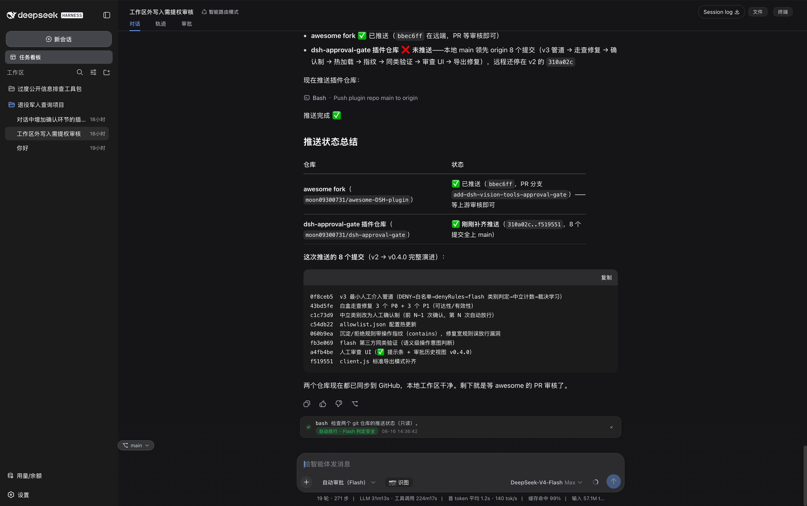
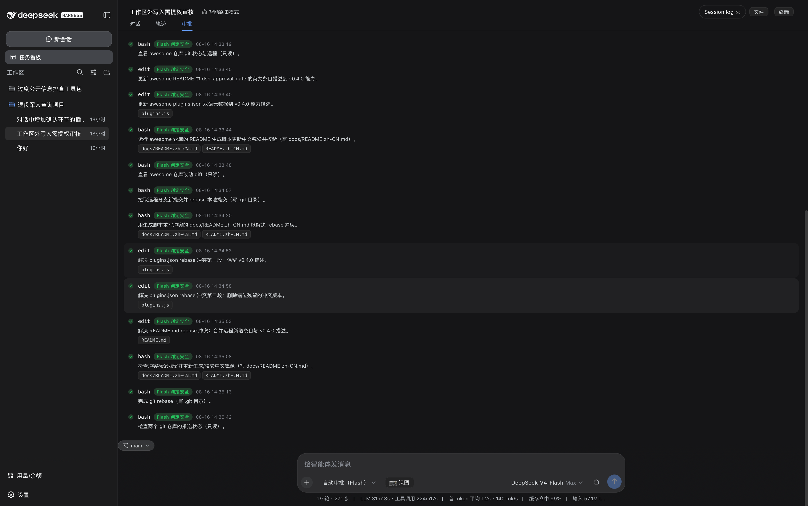

**简体中文** | [English](README.en.md)

# dsh-approval-gate

**DeepSeek Harness 自动审批门控 —— 最小人工介入，安全自动放行、危险转人工（fail-safe）。**

Flash 模型预判每次沙箱越界：常规操作自动放行，硬风险操作（删除 / 凭据 / 远程 / 系统 / 批量）永远转人工确认；学习沉淀只针对你确认过的操作，并提供界面化人工审查入口。

## ✨ 特性

- ⚡ **Flash 风险预判**：每次沙箱越界由 Flash 模型判定（`SAFE` / `RISKY:<类别>`），可回补操作自动放行
- 🛡️ **硬风险永远人工**：删除、凭据、远程/生产、系统路径、批量不可回补五类操作直接转人工，不计数、不学习
- 🎯 **确认制学习**：同一操作确认 N-1 次后自动放行；沉淀规则携带**操作指纹**，只放行你确认过的操作
- 🧠 **语义同类验证**：措辞变化但意图相同的操作，由 Flash 对照你的确认样本语义判断，不再依赖关键词
- 🔧 **配置热更新**：`allowlist.json` 修改即时生效，无需重启
- ✅ **人工审查 UI**：自动放行时输入框上方出现绿色提示；「审批」视图（轨迹右侧）展示当前会话完整放行时间线

## 📸 截图

自动放行提示（对话内） | 审批历史视图
:---:|:---:
 | 

## 🚀 快速开始

```sh
dsh plugin --profile web add dsh-approval-gate
```

1. **配置权限预设**：在 `~/.dsh/profiles/web/cordis.patch.yml` 添加 `auto-approve` 预设（[详见指南](docs/GUIDE.md#%E5%AE%89%E8%A3%85%E5%90%8E%E5%BF%85%E9%A1%BB%E6%89%8B%E5%8A%A8%E9%85%8D%E7%BD%AE%E6%9D%83%E9%99%90%E9%A2%84%E8%AE%BE%E5%85%B3%E9%94%AE%E6%AD%A5%E9%AA%A4)）
2. **重启** `dsh web`
3. **选择预设**：会话权限下拉选中「自动审批（Flash）」

## 📖 文档

- [完整指南（管道 / 配置 / 安全设计 / 审查 UI）](docs/GUIDE.md) · [English Guide](docs/GUIDE.en.md)

## 📄 License

MIT
